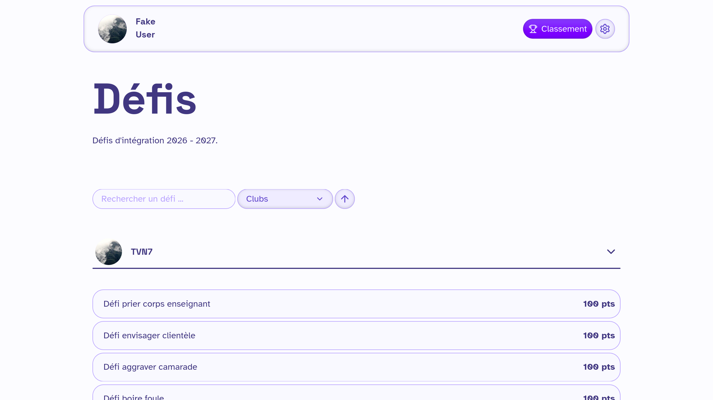

# Site des défis d'intégration 2026 - 2027

## Projet

Ce site a été réalisé dans le cadre du [stage de 2026](https://git.inpt.fr/net7/stage-26-27).



Ce site est connecté à l'API de Churros.
Il permet de faire les actions suivantes :
- Les 2A peuvent proposer des défis pour chaque club.
- Les membres du bureau de chaque club peuvent valider les défis.
- Les 1A, membres d'un groupe d'intégration, peuvent réaliser les défis validés par les clubs.
- Les membres du bureau des clubs respectifs peuvent valider les réalisations.
- Les points sont mis à jour.

## A faire chaque année
- Dans formatCheck changer l'année des groups d'inté

- Dans `.env` mettre `PUBLIC_1ATo2AChurros` à `false` avant l'inté. PENSEZ A LA METTRE A TRUE AU DEBUT DE L'INTE

### Mettre en prod
#### Tester si l'image docker marche 
Tester si l'image de prod marche `docker compose -f docker-compose-test-prod.yml up --build`

#### Mettre en prod (ROOT)
1 - Sur git mettre un TAG 

2 - mettre à jour la version dans deployment.yaml sur fluxcd et dans configmap mettre PUBLIC_1ATo2AChurros à false. **PENSEZ A LA METTRE A TRUE AU DEBUT DE L'INTE**

3 - Supprimer les volumes si ce n'es pas déjà fait 

#### 3 (ROOT)

1 - Se connecter à la db pour mettre admin les personnes que l'on veut


## Contribuer

### Lancer en développement

1. Installer [bun](https://bun.com/) et les dépendences :

```
bun install
```

2. Copier le fichier `.env.exemple` et le renommer `.env`. Remplir le fichier avec les secrets.

3. \[Optionnel\] Si vous voulez lancer le projet sans Authentik, modifier la valeur de `ENABLE_MOCK_AUTH` à `true`.

4. Lancer la base de données avec docker :

```
docker compose up -d
```

5. Préparer Prisma :

Appliquer le schéma à la DB.

```
bun prisma db push
```

6. Remplissage de la base de données (Seed) :

```
bun prisma db seed
```

7. Lancer le projet Svelte :

```
bun --dev run dev
```

### Résolution de problèmes

- Les utilisateurs travaillant sur le projet avant l'intégration seront
  considérés comme 1A par Churros. En effet, la mise à jour est tardive. Pour
  résoudre ce problème, mettre la variable d'environnement dans le `.env`
  `PUBLIC_1ATo2AChurros` à `false` temporairement. PENSEZ A LA METTRE A TRUE AU DEBUT DE L'INTE

- L'ajout des clubs est faite lorsqu'un membre concerné par ce dernier se
  connecte. Si lorsque vous lancez le projet en prod, vous ne voyez pas tous
  les clubs, c'est normal.

- Si on whipe la db les cookie reste sur le site ( car son sur le navigateur ) donc peut arriver probleme de connexion, pensez donc à les supprimer en même temps.

## Stack technique

Ce projet a été développé en Svelte. Il utilise
[Prisma 7](https://www.prisma.io/docs/orm) pour la base de données.

L'UI a été réalisé à l'aide de l'a librairie de composant
[Azucar-UI](https://git.inpt.fr/inp-net/azucar-ui) développé en interne.